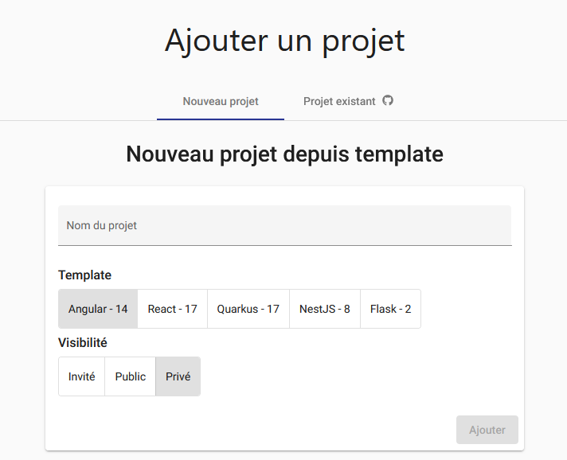
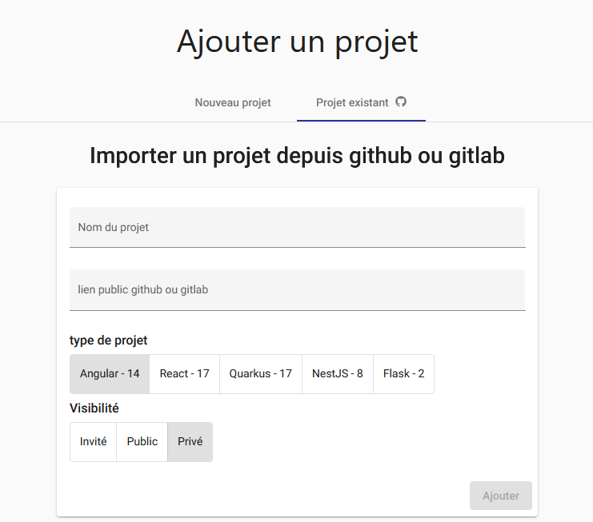
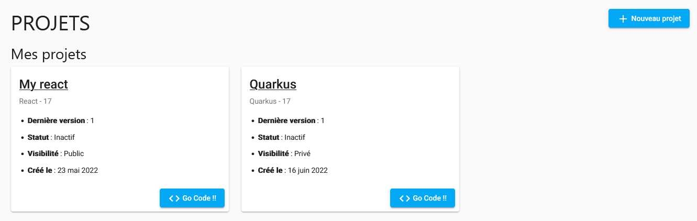
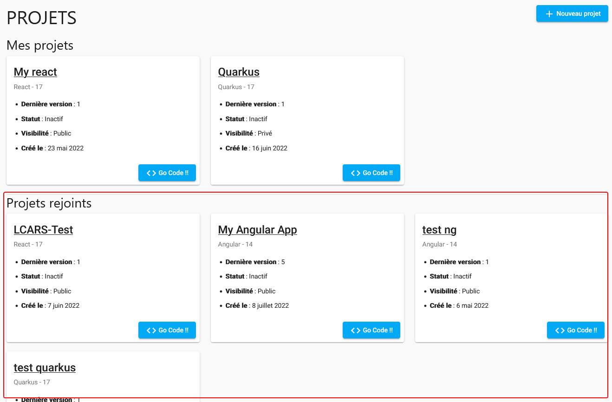
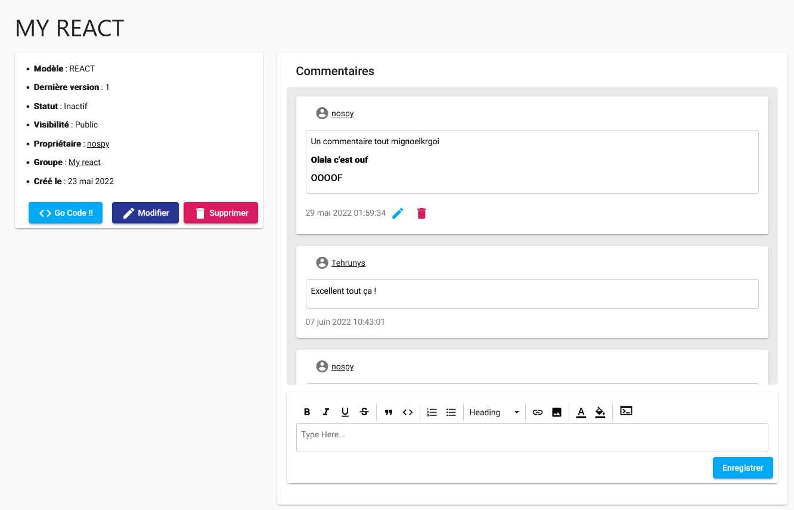

## Projets

Une fois inscrit, vous avez la possibilité de créer un projet. 
C'est une étape indispensable pour pouvoir ensuite développer, car c'est
à ce moment que vous pouvez définir votre modèle et le nom de votre projet.

### Création d'un projet

Rendez-vous sur la page **Projets → Nouveau projet** et donnez un nom à votre projet.

#### Visibilité

Vous avez 3 niveaux de visibilité pour votre projet :

* **Public** : votre projet est visible par tous les utilisateurs de Cloud Coding.
* **Privé** : votre projet est visible uniquement par vous.
* **Invité** : votre projet est visible par vous et les utilisateurs de votre équipe.

#### Création depuis un modèle {#models}

Lors de la création d'un projet sur Cloud Coding,
vous avez le choix entre plusieurs modèles de départ.

##### Modèles disponibles

Il existe actuellement 5 modèles :100: :

- NestJS 8
- React 18.1
- Angular 14
- Quarkus 2.8
- Flask 2.1

:::tip
Vous pouvez également choisir d'importer votre propre projet GitHub,
à condition que ce dernier soit codé dans une des techno disponibles.
:::

#### Import d'un projet GitHub

:::caution Attention
- Même si vous importer un projet GitHub personnel, veillez à sélectionner le modèle correspondant au langage de votre
  projet.
  Auquel cas le projet pourra ne pas se lancer correctement.
- Le projet à importer doit obligatoirement être public.
:::

### Liste des projets

Une fois que vous avez créé un ou plusieurs projets, vous pouvez consulter la liste de ces derniers depuis la page **Projets**.

#### Projets rejoints

Un utilisateur peut également vous inviter dans un groupe et par extension, aux projets de ce dernier.
Lorsque c'est le cas, il est possible de voir sur la liste des projets, ceux auquel vous appartenez.

### Consultation d'un projet

Lorsque vous consultez un projet, vous pouvez voir les détails de celui-ci :

- **Modèle** : le modèle utilisé pour développer le projet.
- **Nom** : le nom du projet.
- **Dernière version** : la dernière version du projet.
- **Visibilité** : la visibilité du projet.
- **Date de création** : la date de création du projet.
- **Propriétaire** : l'utilisateur qui a créé le projet.
- **Groupe** : le groupe auquel appartient le projet (si c'est le cas).
- **Statut** : le statut du projet. (Inactif, Initialisation, En cours d'exécution)

Les seules informations modifiables sont la visibilité et le nom du projet.

Le bouton **Go Code !!!** vous permet de lancer le projet et arriver sur la fenêtre d'édition du code.

#### Commentaires

Un fil de commentaire propre au projet est également présent sur la page de consultation.
Vous pouvez ainsi partager vos idées et vos remarques concernant le projet.

Si le projet est public, les commentaires postés seront visible sur votre profil utilisateur.

