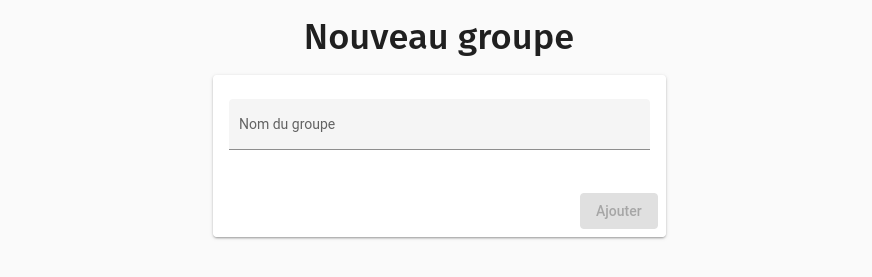
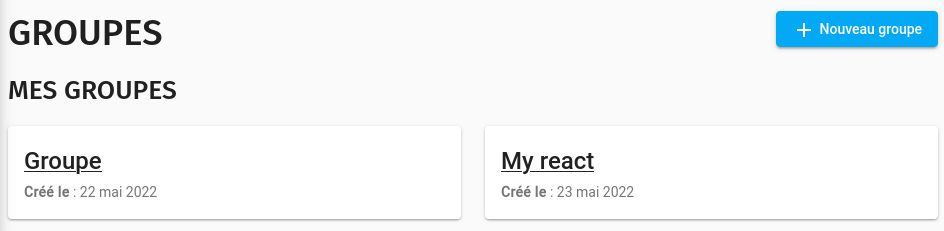
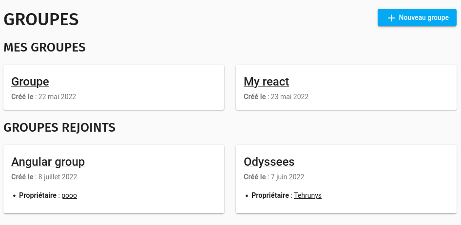
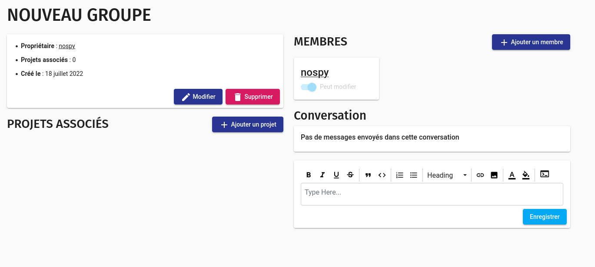
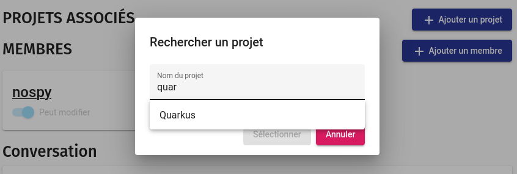
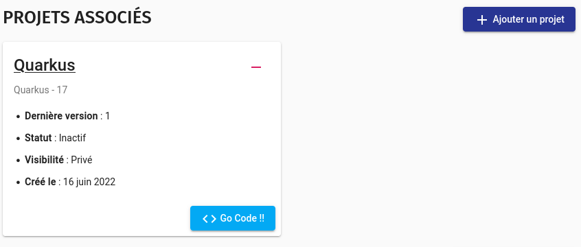
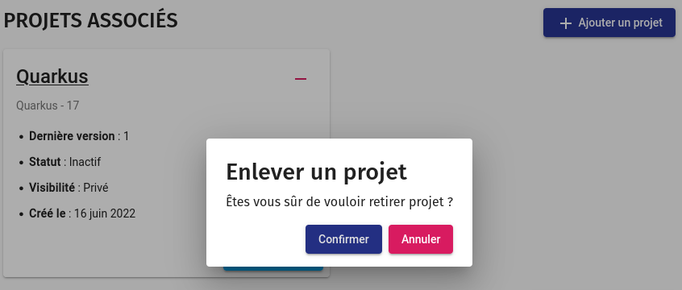
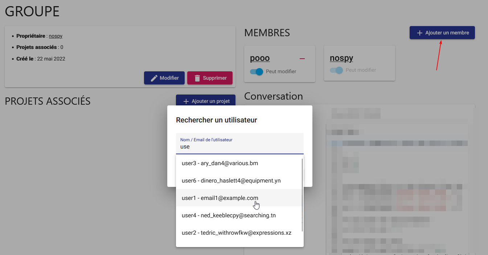
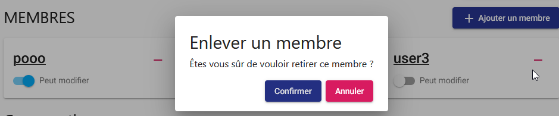
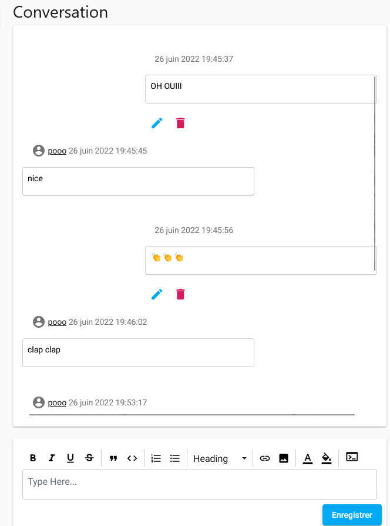

# Groupes

Les groupes sont très importants dans Cloud Coding.
Il faut voir ça un peu comme une _Organisation_ sur Github.

Ces derniers vous permettent d'inviter des membres à vous rejoindre sur un ou plusieurs projets.
Vous pouvez ainsi inviter de gens à rejoindre vos projets privés et à leur assigner des roles.

## Création d'un groupe

Rendez-vous sur la page **Groupe → Nouveau groupe** et donnez un nom à votre groupe.

## Consultation des groupes

Une fois que vous avez créé un ou plusieurs groupes, vous pouvez consulter la liste de ces derniers depuis la page **
Groupes**.

### Groupes rejoints

Lorsqu'un utilisateur vous ajoute à son groupe, vous pouvez consulter les groupes que vous avez rejoints sur la même
page sous la section _groupes rejoints_

## Consultation d'un groupe

Lorsque vous consultez un groupe que vous venez de créer, ce dernier ne contient aucun projet et seulement vous comme
membre.

### Ajout / Retrait d'un projet

Vous pouvez ajouter facilement un projet dans un groupe grâce au bouton **Ajouter un projet**, il vous suffit ensuite de
taper au moins les 3 premières lettres du nom du projet que vous souhaitez ajouter dans votre groupe.

Après quelques secondes, vous verrez apparaitre votre projet dans le groupe.

:::tip
Vous pouvez ajouter des projets publics ou privé dans un groupe, seuls les membres ayant les droits de modification
pourrons éditer le code, les autres membres pourrons seulement le consulter.
:::

Si vous voulez retirer le projet du groupe, il vous suffit de cliquer sur le bouton **-** et de confirmer le retrait du
projet.

### Gestion des membres

L'utilité d'un groupe est de pouvoir ajouter des membres à celui-ci.  
Pour faire cela, vous pouvez cliquer sur le bouton
**Ajouter un membre** et vous aurez la possibilité de rechercher un utilisateur à ajouter dans votre groupe.
Vous pouvez cherche un utilisateur par son nom, son email ou son identifiant.

Il est ensuite possible de lui autoriser la modification du groupe et des projets qu'il contient.

On peut également le retirer du groupe.

### Conversation

Un groupe vous permet d'avoir accès à une conversation privée entre les membres de ce dernier.
Cette conversation est accessible depuis la page **Groupe** de votre groupe. C'est du temps réel, il n'y a pas besoin de
rafraichir la page pour voir les messages. Vous pouvez formatter vos messages grâce à un éditeur de texte riche en balises.

