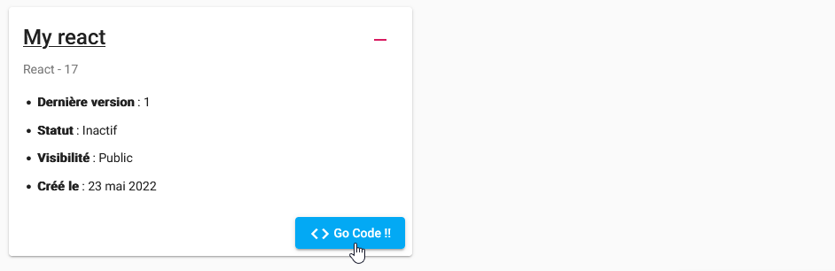
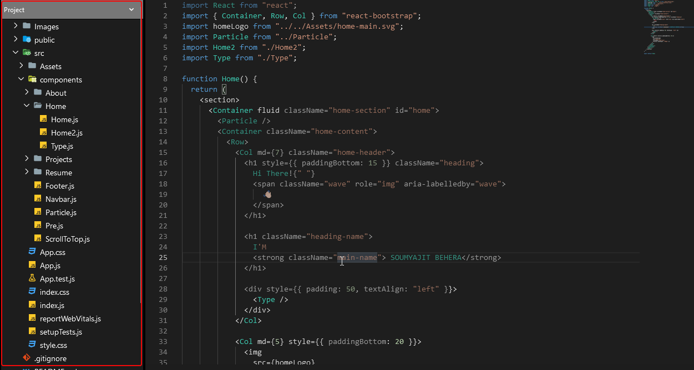

# Code éditeur

Lorsque vous cliquez sur le bouton **Go Code !!!**, présent à différents endroits où les projets sont affichés, vous
atteignez la page d'édition du code.

Si le projet n'était pas lancé, il faut attendre un peu pour qu'il démarre et soit consultable.

## Arbre du code

Comme nous codons des projets entiers, il est important d'avoir une vue de l'arborescence de nos fichiers de code. Nous
avons donc développé pour cela un outil de navigation dans l'arbre de notre projet.

## Rendu temps réel

Une fois démarré, vous pouvez voir le rendu temps réel de votre application sur le côté droit de l'éditeur. Ce n'est ni
plus ni moins qu'un `iframe` pointant sur le lien assigné de votre projet. Vous pouvez donc parfaitement copier le lien
de
votre application et le partager à qui vous voulez, du moment que le projet est lancé.

## Consultation du lien

Le lien apparaissant au-dessus du rendu de votre application est public et peut être consulté par tout le monde.
Il suffit de le copier / coller dans un navigateur web pour voir le rendu de votre application.

## Développeurs connectés

Il est possible d'être plusieurs développeurs connectés en même temps sur un projet. Lorsque c'est le cas, il est
important de pouvoir voir qui est connecté en même temps que nous. 
Il est possible d'avoir cette information depuis le menu de gauche de l'éditeur. 
Un lien est disponible pour ouvrir un onglet sur la consultation du groupe afin d'avoir accès à la conversation.

## Appel visio

Parce que ce n'est pas facile d'avoir une conversation écrite en même temps que nous codons, et parce qu'un des
objectifs de notre application est l'aspect social, nous avons développé une fonctionnalité qui permet aux développeurs
éditant un projet en même temps de pouvoir passer un appel vidéo directement depuis l'éditeur de code 💯💯💯.

## Versioning

Un développeur change souvent d'avis, il peut donc avoir des versions différentes de son code.
Nous lui permettons ainsi de faire des `snapshots` de son code, afin de pouvoir revenir à une version précédente.
