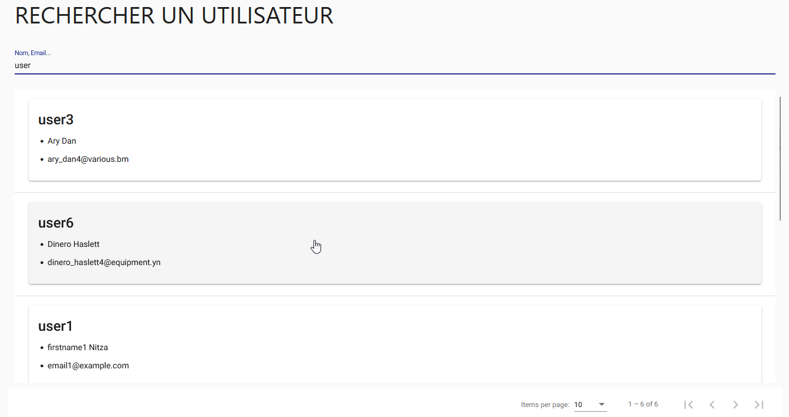
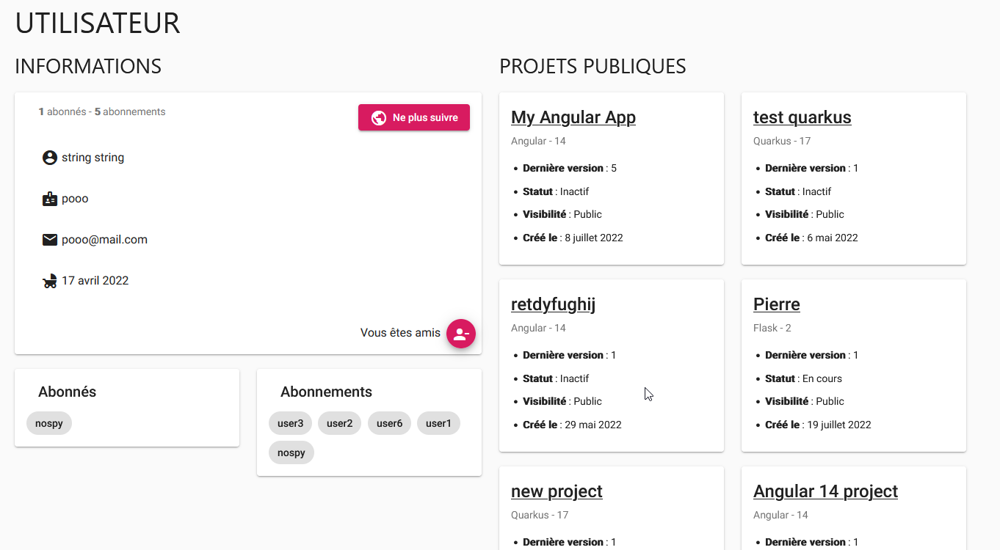
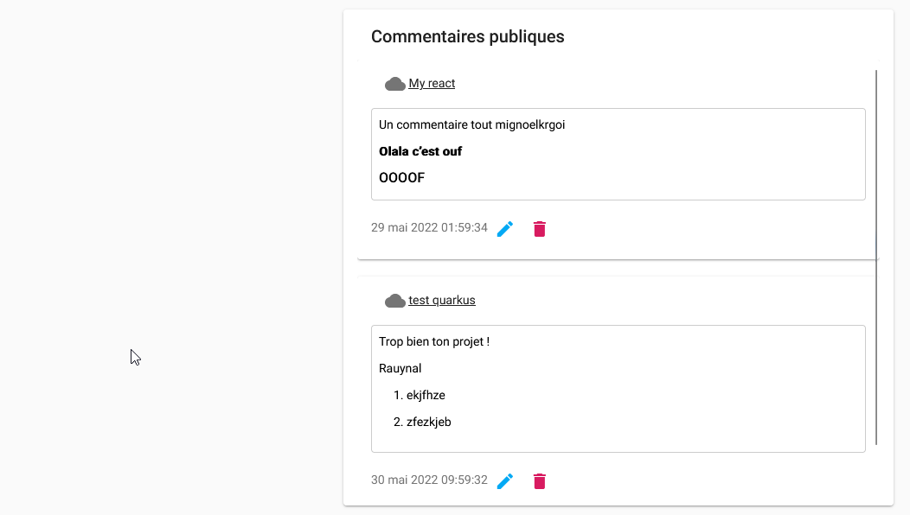

# Réseau social

La philosophie de Cloud Coding est de rendre le développement social, de pouvoir partager et collaborer à plusieurs
dessus. Ce n'est donc pas étonnant de retrouver dans notre application un tas de fonctionnalités allant dans ce sens !

## Explorer

En vous rendant sur la page **Social**, vous pouvez explorer les différents réseaux sociaux que nous avons développés.

### Utilisateurs

Cette partie vous permet de rechercher les utilisateurs inscrits sur Cloud Coding.
Vous avez accès à une barre de recherche pour vous permettre de rechercher un utilisateur par son nom ou par son
email.

Lorsque vous consultez un utilisateur, vous pouvez voir ses informations, ses projets publics, les personnes qui le
suivent,
ses commentaires postés sur des projets publics....

---

### Projets publics

## Relations

### Amis

#### Conversation

### Followers / Followings
