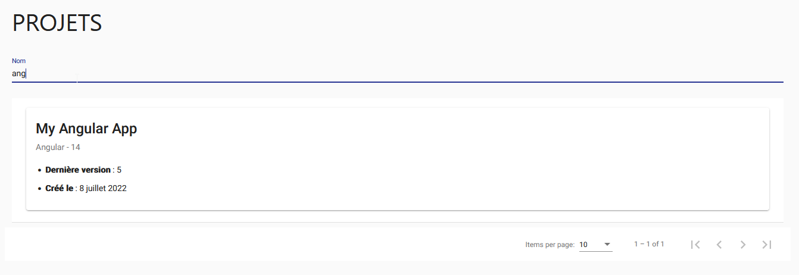
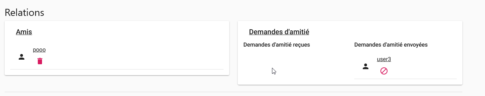
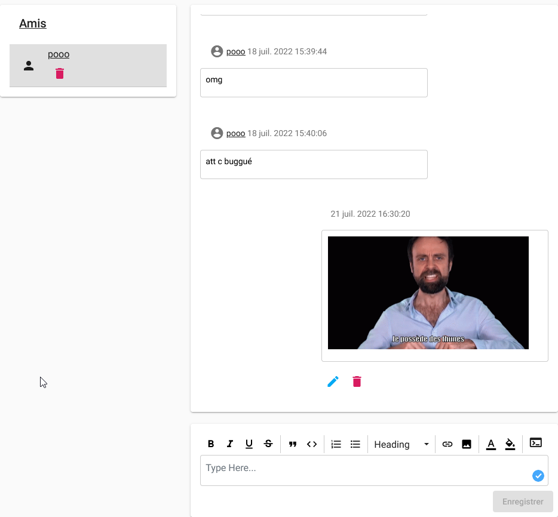
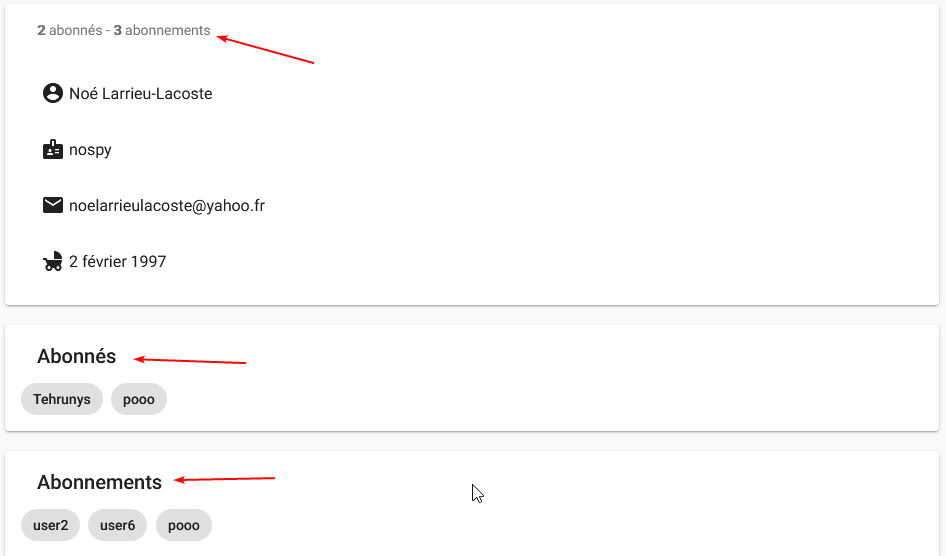

# Réseau social

La philosophie de Cloud Coding est de rendre le développement social, de pouvoir partager et collaborer à plusieurs
dessus. Ce n'est donc pas étonnant de retrouver dans notre application un tas de fonctionnalités allant dans ce sens !

## Explorer

En vous rendant sur la page **Social**, vous pouvez explorer les différents réseaux sociaux que nous avons développés.

### Utilisateurs

Cette partie vous permet de rechercher les utilisateurs inscrits sur Cloud Coding.
Vous avez accès à une barre de recherche pour vous permettre de rechercher un utilisateur par son nom ou par son
email.

Lorsque vous consultez un utilisateur, vous pouvez voir ses informations, ses projets publics, les personnes qui le
suivent,
ses commentaires postés sur des projets publics....

---

### Projets publics

Cette partie vous permet de rechercher des projets publics. Vous avez accès à une barre de recherche pour vous permettre
de rechercher un projet par son nom.

La consultation d'un projet est la même que celle d'un projet vous appartenant.

## Relations

Que serait un réseau social sans relations entre les utilisateurs ? C'est une question réthorique, bien sûr !

C'est pourquoi nous avons poussé cet aspect sur notre application afin de pouvoir suivre des utilisateurs, ou encore
avoir des amitiés.

:::info
Les amitiés dans la vraie vie, c'est mieux quand même.
:::

### Amis

Vous pouvez demander d'autres utilisateurs en amis. L'autre utilisateur doit accepter votre demande.
Vous pouvez sur la page **Social** voir les demandes d'amis que vous avez reçus ainsi que celle en attente.

#### Conversation

Lorsque vous êtes amis avec un autre utilisateur, vous pouvez discuter avec lui.
Il suffit de se rendre sur la page **Social → Amis** et de cliquer sur le nom de l'utilisateur avec qui vous souhaitez
discuter.

Les messages envoyés peuvent être modifiés ou supprimés.

### Followers / Followings

Si vous ne souhaitez pas ajouter les utilisateurs en amis, mais suivre les projets publics de ces utilisateurs, vous
pouvez _suivre_ les utilisateurs que vous souhaitez et inversement.

