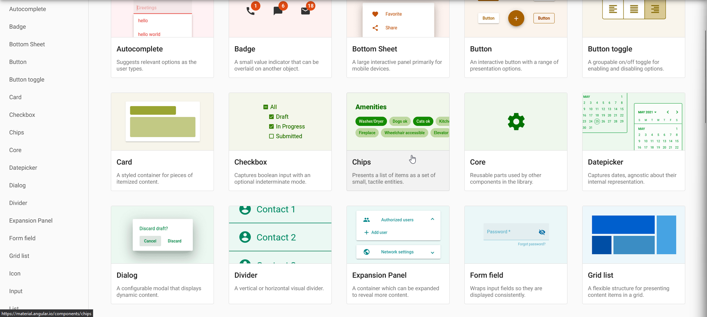
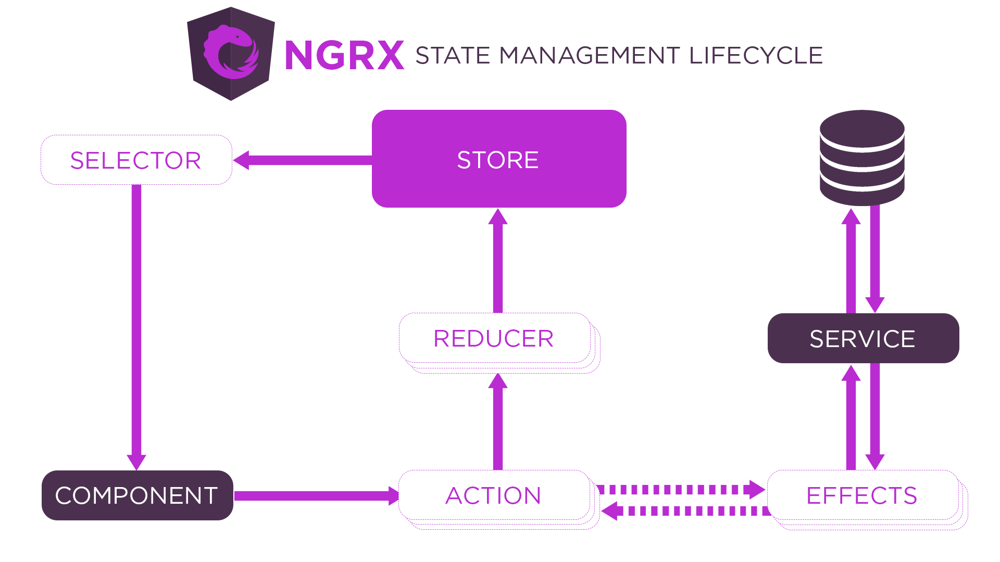
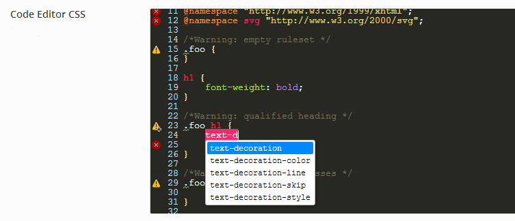
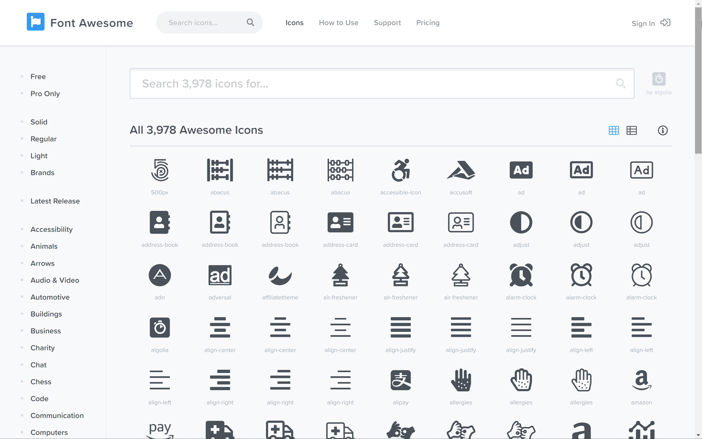
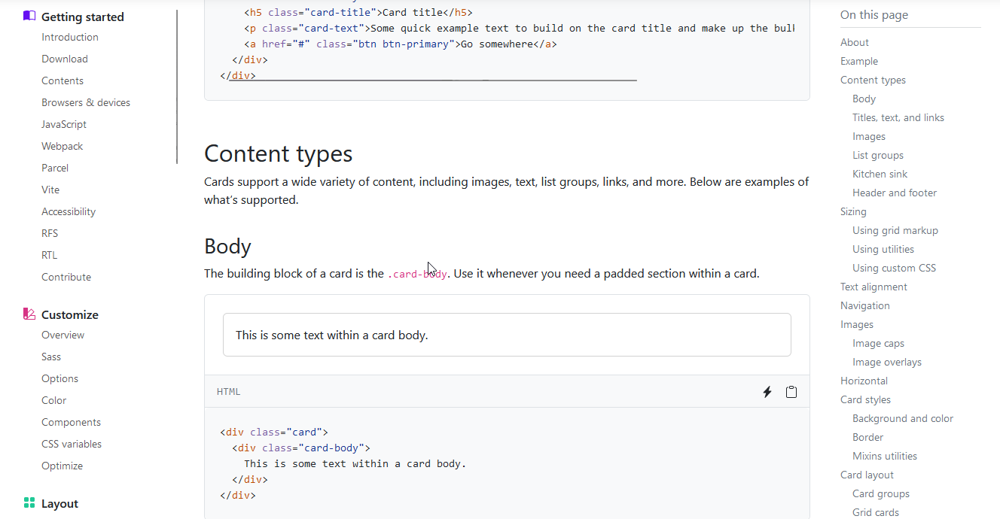
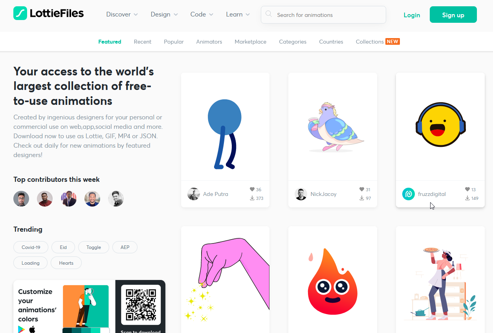

# Technologies utilisées

Pour mener à bien ce magnifique projet, nous avons dû mettre la main à la pate et utiliser plusieurs technologies.

## Angular

Afin de développer un frontend moderne et responsive, nous avons utilisé [Angular](https://angular.io/).

Le choix était tout indiqué, car ce Framework est très puissant et possède tout un tas de librairies annexes permettant
d'enrichir son fonctionnement.

### Librairies

Plus d'une dizaine de librairies ont été ajouté à Angular, afin de rendre notre application plus performante et unique.

#### Angular Material

[Angular Material](https://material.angular.io/) est une librairie qui permet de rendre les interfaces de l'application
plus agréables et plus riches. Elle donne accès à une multitude de composants et de fonctions.

#### NGRX

[NGRX](https://ngrx.io/) est un groupe de librairies inspirées par le pattern Redux, qui est lui-même inspiré du pattern
Flux.
Le pattern ngrx est un pattern de gestion d'état. Il stocke l'état de l'application (State) dans un Store.

Dans notre application, nous avons utilisé un Store pour stocker l'état de l'application et des différentes informations
présentes dessus.

#### Code Mirror

[CodeMirror](https://codemirror.net/) est un composant d'éditeur de code pour le Web. Il peut être utilisé dans les
sites Web pour implémenter un
champ de saisie de texte avec prise en charge de nombreuses fonctionnalités d'édition et dispose d'une interface de
programmation riche pour permettre une extension supplémentaire.

#### Font Awesome

[Font Awesome](https://fontawesome.com/) est une police d'écriture et un outil d'icônes qui se base sur CSS, Less et
Sass.

#### Bootstrap

[Bootstrap](https://getbootstrap.com/) est une collection d'outils utiles à la création du design de sites et d'
applications web. C'est un ensemble
qui contient des codes HTML et CSS, des formulaires, boutons, outils de navigation et autres éléments interactifs, ainsi
que des extensions JavaScript en option.

#### Lottie

Le format [Lottie](https://lottiefiles.com/) est un format ouvert d'animation vectorielle basé sur JSON créé à l'origine
par la branche de design de
Airbnb avec son plugin d'export BodyMovin, pour les animations produites sous After Effects.

#### Socket.io Client

[Socket.IO](https://socket.io/fr/) est une bibliothèque qui permet une communication à faible latence, bidirectionnelle et basée sur les
événements entre un client et un serveur.

Il repose sur le protocole WebSocket et offre des garanties supplémentaires telles qu'un mode dégradé en HTTP
long-polling ou la reconnexion automatique.

## NestJS

### Librairies

#### TypeORM

#### Passport

#### Swagger UI

#### Socket.IO

#### MailJet

#### Unique names generator

## RabbitMQ

## PostgreSQL

## Flask

### Avionix

## Kotlin

## Docusaurus
