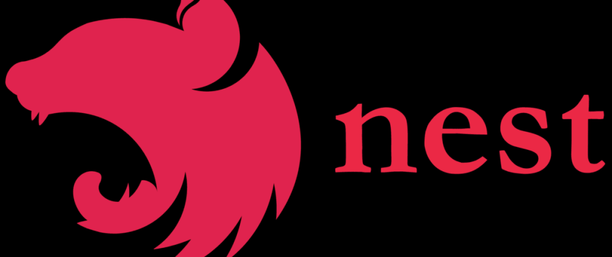
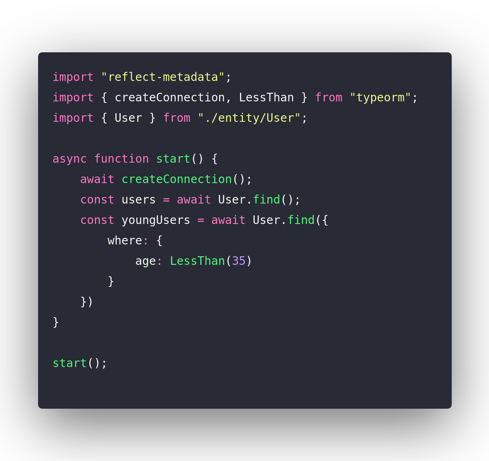
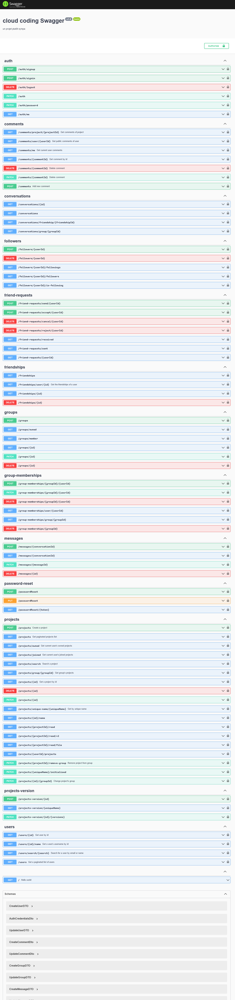

# Technologies utilisées

Pour mener à bien ce magnifique projet, nous avons dû mettre la main à la pate et utiliser plusieurs technologies.

## Angular

Afin de développer un frontend moderne et responsive, nous avons utilisé [Angular](https://angular.io/).

Le choix était tout indiqué, car ce Framework est très puissant et possède tout un tas de librairies annexes permettant
d'enrichir son fonctionnement.

### Librairies

Plus d'une dizaine de librairies ont été ajouté à Angular, afin de rendre notre application plus performante et unique.

#### Angular Material

[Angular Material](https://material.angular.io/) est une librairie qui permet de rendre les interfaces de l'application
plus agréables et plus riches. Elle donne accès à une multitude de composants et de fonctions.

#### NGRX

[NGRX](https://ngrx.io/) est un groupe de librairies inspirées par le pattern Redux, qui est lui-même inspiré du pattern
Flux.
Le pattern ngrx est un pattern de gestion d'état. Il stocke l'état de l'application (State) dans un Store.

Dans notre application, nous avons utilisé un Store pour stocker l'état de l'application et des différentes informations
présentes dessus.

#### Code Mirror

[CodeMirror](https://codemirror.net/) est un composant d'éditeur de code pour le Web. Il peut être utilisé dans les
sites Web pour implémenter un
champ de saisie de texte avec prise en charge de nombreuses fonctionnalités d'édition et dispose d'une interface de
programmation riche pour permettre une extension supplémentaire.

#### Font Awesome

[Font Awesome](https://fontawesome.com/) est une police d'écriture et un outil d'icônes qui se base sur CSS, Less et
Sass.

#### Bootstrap

[Bootstrap](https://getbootstrap.com/) est une collection d'outils utiles à la création du design de sites et d'
applications web. C'est un ensemble
qui contient des codes HTML et CSS, des formulaires, boutons, outils de navigation et autres éléments interactifs, ainsi
que des extensions JavaScript en option.

#### Lottie

Le format [Lottie](https://lottiefiles.com/) est un format ouvert d'animation vectorielle basé sur JSON créé à l'origine
par la branche de design de
Airbnb avec son plugin d'export BodyMovin, pour les animations produites sous After Effects.

#### Socket.io Client

[Socket.IO](https://socket.io/fr/) est une bibliothèque qui permet une communication à faible latence, bidirectionnelle
et basée sur les
événements entre un client et un serveur.

Il repose sur le protocole WebSocket et offre des garanties supplémentaires telles qu'un mode dégradé en HTTP
long-polling ou la reconnexion automatique.

## NestJS

[NestJS](https://nestjs.com/) est un framework Node.js permettant de créer des applications back-end robustes et
scalable.

Nous avons choisi ce framework, car il est très performant et permet de créer des applications back-end avec typescript.

### Librairies

Plusieurs librairies ont été ajoutées à NestJS, afin de rendre notre application plus performante et unique.

#### TypeORM

[TypeORM](https://typeorm.io/#/) est un ORM (Object Relational Mapping) qui permet de faire le lien entre les objets
d'une application et les tables d'une base de données relationnelle.

#### Passport

[Passport](http://www.passportjs.org/) est un middleware d'authentification pour Node.js. Il est extrêmement flexible et
peut être facilement adapté à une application ou un service Web existant.

#### Swagger UI

[Swagger UI](https://swagger.io/tools/swagger-ui/) est une interface utilisateur pour les API RESTful. Il permet de
visualiser et d'interagir avec les ressources d'une API sans avoir à coder une interface utilisateur.

Nous nous sommes beaucoup servis de cette librairie pour tester nos API.

#### Socket.IO

[Socket.IO](https://socket.io/fr/) est une bibliothèque qui permet une communication à faible latence, bidirectionnelle
et basée sur les événements entre un client et un serveur.

Nous nous en servons pour tout ce qui est communication en temps réel (édition de code, envoie de message, appel vision,
...)

#### MailJet

[MailJet](https://www.mailjet.com/) est un service d'envoi d'email. Nous nous en servons pour envoyer des emails à nos
utilisateurs.

#### Unique names generator

[Unique names generator](https://www.npmjs.com/package/unique-names-generator) est une librairie qui permet de générer
des noms uniques. Cela nous permet de créer des noms de domaines aléatoires et amusants pour les différents projets.

## RabbitMQ

[RabbitMQ](https://www.rabbitmq.com/) est un message broker open source. Il permet de faire communiquer des applications
entre elles.

Nous nous en servons pour faire communiquer notre application NestJS et nos lanceurs d'exécution de code.

## PostgreSQL

[PostgreSQL](https://www.postgresql.org/) est un système de gestion de base de données relationnelle objet (SGBDRO)
libre et multiplateforme.

Nous avons choisi cette base de données, car elle est très performante et très fiable.

## Flask

[Flask](https://flask.palletsprojects.com/en/2.0.x/) est un framework web Python léger et flexible. Il est conçu pour
être facile à apprendre et à utiliser. Il est également conçu pour être simple à étendre et à intégrer avec d'autres
bibliothèques et applications.

Nous avons choisi ce framework pour créer nos lanceurs d'exécution de code, afin que ces derniers aient tous la même
interface.

## Kotlin

[Kotlin](https://kotlinlang.org/) est un langage de programmation multiplateforme, orienté objet et fonctionnel,
développé par JetBrains.

Il est utilisé pour développer notre application mobile Android.

## Docusaurus

[Docusaurus](https://docusaurus.io/) est un générateur de site web statique open source pour la documentation technique.

Nous avons choisi ce générateur de site web, car il est très performant et permet de créer des sites web statiques, afin
d'héberger notre documentation.
