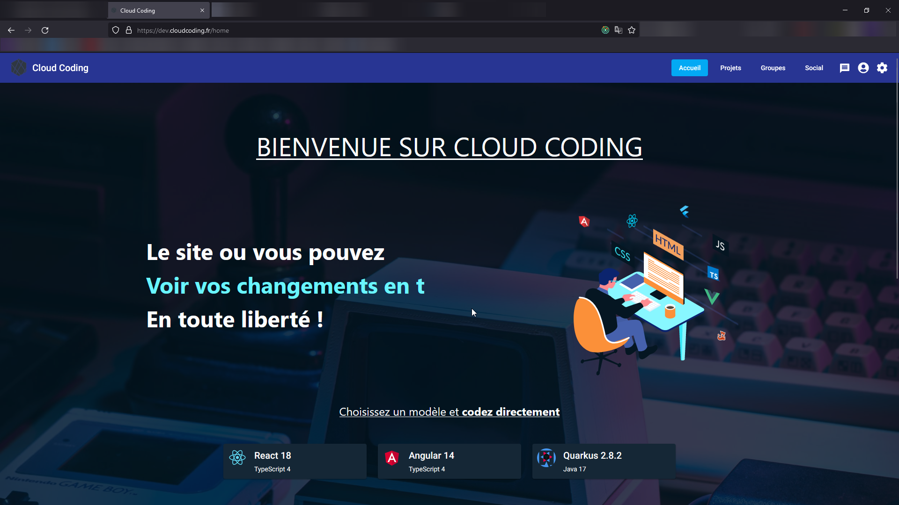

# Bienvenue sur la documentation Cloud Coding ! :champagne::champagne::champagne:

Cloud Coding est une plate-forme collaborative permettant de développer
des applications web directement dans votre navigateur.

Vos applications sont développées avec un rendu en temps réel,
disponible grâce à un lien généré sur le domain principale de [Cloud Coding](https://cloudcoding.fr).

## Différents modèles à disposition

Nous mettons plusieurs [modèles](presentation/projets/#models) à disposition lors de la création d'un projet,
afin de vous aider à définir votre projet.

## Réseau social

Cloud Coding, c'est aussi un réseau social. Vous pouvez partager vos projets,
suivre plusieurs développeurs, discuter avec eux, etc.
